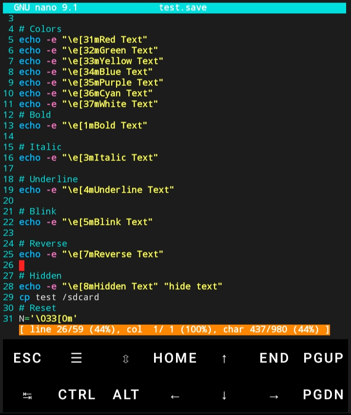

# Nano Setup

Custom Nano configuration for Termux.

## Installation

```bash
bash <(curl -fsSL https://raw.githubusercontent.com/PRINCE-7081/nano-setup11/main/install.sh)
```

## Features

- Line numbers
- Auto indent
- Smart Home key
- Tabs to spaces
- Soft wrap
- Cursor position memory
- Custom colors
- Clean interface

## Developer



**PRINCE-7081**